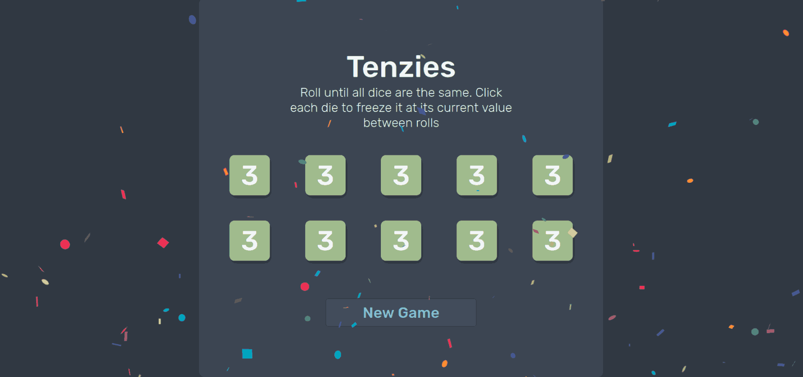

<h1 style="text-align: center;">Tenzies Game</h1>
  
  
 

 

> This project is from the [Scrimba React course](https://v2.scrimba.com/learn-react-c0e) course by Bob Ziroll.
> The styling is in the very aesthetic [NordTheme](https://www.nordtheme.com/)

 
